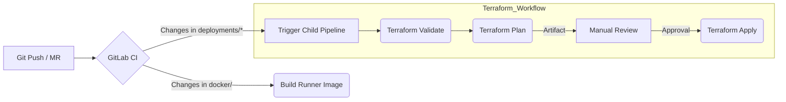

# Infrastructure Deployments

## Overview

This repository hosts the **Infrastructure as Code (IaC)** for a modern, scalable data platform. It leverages **Terraform** for provisioning and **GitLab CI** for automated, multi-stage deployment pipelines. The infrastructure is designed to be modular, reliable, and strictly version-controlled, enabling consistent environments from development to production.

The core objective of this project is to deploy and manage a suite of distributed data engineering and observability tools on top of Kubernetes.

## 🏗️ System Architecture


## 🚀 Technology Stack

### Core Infrastructure
-   **IaC**: [Terraform](https://www.terraform.io/) - Used for defining and provisioning all infrastructure resources.
-   **Orchestration**: [Kubernetes](https://kubernetes.io/) - The container orchestration platform hosting all services.
-   **Containerization**: [Docker](https://www.docker.com/) - Used for building custom images and running services.

### CI/CD
-   **GitLab CI/CD**: Powering the automation pipeline.
    -   **Dynamic Child Pipelines**: Used to trigger specific deployment jobs only when relevant files change.
    -   **Terraform Automation**: Custom runner images and scripts to handle `init`, `validate`, `plan`, and `apply` stages safely.

## 🛠️ Deployed Services

This repository manages the deployment of the following key components:

| Service | Category | Description |
| :--- | :--- | :--- |
| **[Apache Airflow](https://airflow.apache.org/)** | Orchestration | Platform to programmatically author, schedule, and monitor workflows. |
| **[Trino](https://trino.io/)** | Query Engine | Distributed SQL query engine for big data analytics. |
| **[Apache Superset](https://superset.apache.org/)** | Visualization | Modern data exploration and visualization platform. |
| **[Keycloak](https://www.keycloak.org/)** | Security | Open Source Identity and Access Management (IAM) for modern applications. |
| **[Apache Kafka](https://kafka.apache.org/)** | Streaming | Distributed event streaming platform for high-performance data pipelines. |
| **[MinIO](https://min.io/)** | Storage | High-performance, S3-compatible object storage. |
| **[OpenBao](https://openbao.org/)** | Security | Secure secret management and data protection (community fork of Vault). |
| **[PostgreSQL](https://www.postgresql.org/)** (via **[CloudNativePG](https://cloudnative-pg.io/)**) | Database | Shared relational database service for application metadata. |

## 📂 Repository Structure

```plaintext
.
├── ci-templates/   # Reusable GitLab CI configuration snippets
├── deployments/    # Terraform configurations for each service (the heart of the repo)
│   ├── airflow/
│   ├── database/
│   ├── kafka/
│   ├── keycloak/
│   ├── minio/
│   ├── openbao/
│   ├── superset/
│   └── trino/
├── docker/         # Dockerfiles for custom CI runner images
├── scripts/        # Helper scripts for automation and maintenance
└── .gitlab-ci.yml  # Main CI entry point
```

## 🔄 CI/CD Workflow

The deployment pipeline follows a rigorous process to ensure stability:



1.  **Build**: Custom Docker images for the Terraform runner are built (if `docker/Dockerfile` changes).
2.  **Validate**: Terraform configuration is linted and validated for syntax errors.
3.  **Plan**: A speculative execution plan is generated and stored as an artifact. This allows for manual review of proposed changes.
4.  **Execute**: The generated plan is applied to the live environment.

## ✨ Key Features

-   **Modular Design**: Each service is isolated in its own directory under `deployments/`, allowing for independent updates.
-   **GitOps Principles**: All changes are tracked in Git; manual changes to infrastructure are discouraged.
-   **State Management**: Terraform state is managed remotely to ensure consistency and locking.